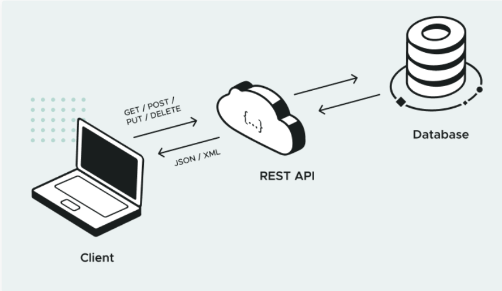
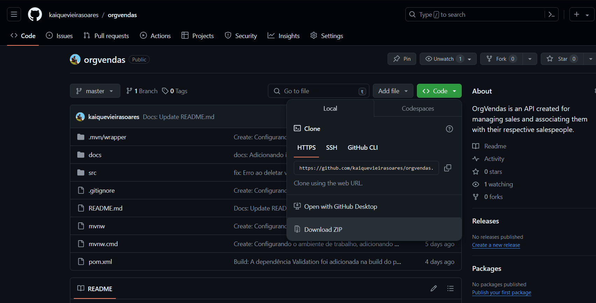
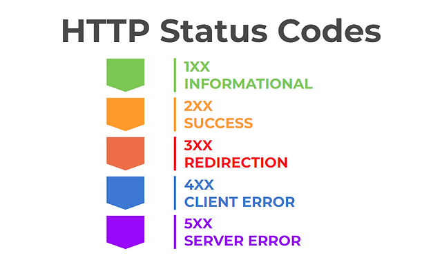

#   OrgVendas - Organize your sales easily


This API was created for managing sales associated with their respective sellers. It was developed using Spring, spring boot and Java. The project is open-source and free for any use, thanks.

## Tecnologias Utilizadas 🧑‍💻

[](https://skillicons.dev)
## Introdução a APis Restful

- ### O que é uma API ?
  API - é um termo para designar uma interface de comunicação que um sistema oferece para que outros acessem suas funções, dados e recursos sem que o software ou plataforma externa precise saber como eles foram implementados. Trata-se de um conjunto de rotinas e padrões muito utilizados na web para facilitar a integração entre diferentes sites e aplicativos.

- ### Como Funciona uma API RESTFUL ?
  Uma API RESTful funciona através da manipulação de recursos e representações. Essas representações são trocadas entre os usuários e o servidor através de uma interface padronizada e de um protocolo de comunicação específico — geralmente o HTTP. Assim, quando um usuário deseja usar uma funcionalidade da aplicação, seu dispositivo envia uma solicitação via HTTP ao servidor. O servidor localiza o recurso e comunica a representação do estado dele na resposta ao usuário através do mesmo protocolo. E são essas representações que podem ser feitas em diversos formatos.

-  
  Caso ainda tenha duvidas de como uma API RESTFUL funciona, recomendo a leitura do site: (https://www.hostinger.com.br/tutoriais/api-restful)


### Como Instalar o Projeto.
- #### Clone esse Reposítorio em sua maquina, isso pode ser feito via git com o comando:
  ``` git clone https://github.com/kaiquevieirasoares/orgvendas.git```


ou diretamente do Github:




### End-points da API
## Tabela de Vendedor
#### Get-All- retorna todos os vendedores e suas respectivas médias de acordo com as datas.
URL: http://localhost:8080/api/v1/vendedor

- - Body necessário :  {
    "data-inicial":"1999-02-03",
    "data-fim":"1999-09-07"
    }
#### post - Cria um vendedor .
URL: http://localhost:8080/api/v1/vendedor/post
- - Body necessário :  {"nome": "nome do vendedor"}

#### update - atualiza um vendedor existente a partir do ID.
URL: http://localhost:8080/api/v1/vendedor/update/1
obs: o número é o ID do vendedor.
- - Body necessário :  {"nome": "novo nome para atualização"}


#### delete - deleta um vendedor a partir do id.
URL: http://localhost:8080/api/v1/vendedor/delete/3
- - obs: A requisição para deletar um vendedor só funcionará se o vendedor não tiver vendas associadas a ele.
- - Obs: o número é o ID do vendedor

## Tabela de Vendas
#### post - cria uma venda.
URL: http://localhost:8080/api/v1/vendas/post
- - body necessário: {
  "valor":1800 ,
  "data_venda":"2023-05-10",
  "vendedor_id":1
  }
- Obs: A venda só será criada se o vendedor associado ao ID exister no bando de dados.


#### delete - deleta uma venda a partir do id.
URL: http://localhost:8080/api/v1/vendas/delete/1

- Obs: O último número representa o ID da venda.


## Instalando as dependências listadas no pom.xml.

- ``` mvn install```

- - ### Compilando o projeto.
-  ``` mvn compile```

- ### Testando o projeto
- ``` mvn test```


### Tabela de Códigos HTTP 




### Pronto, seu projeto está pronto para ser iniciado!


##### Esse projeto é open-source. 

###### I love programming ❤️